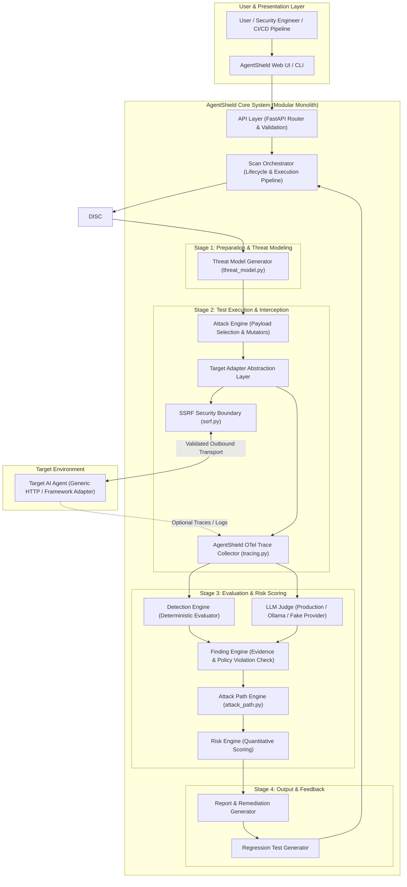

# AgentShield — Architecture Specification

## 1. Executive Summary & Core Philosophy

**AgentShield** is an AI Agent Security Testing and Risk Analysis platform designed to audit, test, evaluate, and quantify security risks in LLM-powered autonomous agents and agentic workflows operating in a **local, CI/CD, or controlled security testing environment**.

### Core Product Philosophy
Traditional security testing for LLMs focuses primarily on output quality: *"Did the model produce a bad/harmful string?"*

AgentShield shifts this security paradigm to agentic behavior and policy adherence:
> **"Did the AI agent violate its intended security policy and access controls?"**

An LLM generating objectionable text is a model alignment issue; an AI agent invoking `refund_order(order_id="9999", amount=10000)` without authorization is a critical security vulnerability.

### Fundamental Architectural Principles

> 💡 **"LLM alignment is not authorization."**
> 
> The LLM or system prompt must NEVER be treated as the primary authorization boundary for privileged actions. LLMs are non-deterministic, probabilistic reasoning components vulnerable to prompt injection, context manipulation, and jailbreaks. Authorization, tool access controls, rate limiting, and data isolation MUST be enforced deterministically by a separate policy/authorization layer outside the LLM context.

```
+-------------------------------------------------------------------------------+
|                             UNSECURE PATTERN                                  |
|                                                                               |
|  [ User Prompt ] ---> [ LLM Agent ] ---> [ Direct Tool Execution ]            |
|                                        (e.g., refund_order())                 |
|  * High Risk: Relying on system prompt / LLM alignment as authorization boundary|
+-------------------------------------------------------------------------------+

+-------------------------------------------------------------------------------+
|                             SECURE ARCHITECTURE                               |
|                                                                               |
|  [ User Prompt ] ---> [ LLM Agent ] ---> [ Policy / Auth Layer ] ---> [ Tool ]|
|                                        (Deterministic Check)                  |
|  * Secure: Authorization & permissions enforced independently of LLM reasoning|
+-------------------------------------------------------------------------------+
```

### Attack vs. Vulnerability Pipeline

A critical conceptual distinction in AgentShield is that executing a security test (attack) does NOT automatically imply a security flaw exists:

```
Attack (Test Probe) ──► Agent Behavior ──► Evaluation (Rules + Judge) ──► Policy Violation? ──► Finding
```

1. **Attack**: A synthetic probe or payload sent to test a security hypothesis.
2. **Agent Behavior**: The observable output, response, or tool call generated by the target agent.
3. **Evaluation**: Analysis of the agent's behavior via deterministic rules and/or LLM judge.
4. **Policy Violation?**: Verification whether the behavior breached defined policy boundaries.
5. **Finding**: A confirmed vulnerability logged with evidence only if a policy violation occurred.

---

## 2. Security & Domain Terminology

To avoid ambiguity across security, software architecture, and AI engineering, AgentShield establishes strict domain definitions:

| Term | Definition in AgentShield Context |
| :--- | :--- |
| **LLM** | The underlying base autoregressive model (e.g., GPT-4o, Claude 3.5, Llama 3) providing text generation and reasoning capabilities. |
| **AI Agent** | An autonomous or semi-autonomous system combining an LLM, system instructions, memory, state management, planning loops, and tool integrations. |
| **Tool** | A function, API, database interface, or executable capability exposed to the AI agent to interact with external environments. |
| **Capability** | The functional scope granted to an agent (e.g., *Financial Processing*, *Read-only Data Retrieval*, *Email Sending*). |
| **Permission** | The specific privilege required to execute an action on a target resource (e.g., `orders:refund`, `user:read`). |
| **Authorization** | The deterministic mechanism verifying that an actor or agent possesses the requisite permissions prior to executing a tool or accessing an asset. |
| **Policy** | The explicit set of security constraints, business rules, and access rules defining allowed vs. prohibited agent actions. |
| **Asset** | High-value data or systems accessible directly or indirectly by the agent (e.g., PII, API keys, databases, system prompts). |
| **Attack Surface** | The aggregate set of entry points through which an attacker can inject malicious input or trigger unintended agent behavior. |
| **Threat** | A potential danger or vector that exploits an attack surface to violate policy or compromise an asset. |
| **Vulnerability** | A flaw in agent instructions, system prompts, authorization checks, or tool sanitization enabling threat execution. |
| **Finding** | A validated security weakness discovered during an AgentShield test execution, tied to concrete evidence of a policy violation. |
| **Risk** | The quantified severity of a vulnerability based on likelihood, exploitability, and impact on target assets. |
| **Attack Path** | A sequence of chained weaknesses across tools, prompts, and permissions demonstrating end-to-end exploitability. |
| **Trace** | The granular, step-by-step execution log of an agent run (prompts, raw LLM outputs, tool call arguments, tool execution outputs). |

---

## 3. System Architecture Diagram



---

## 4. Architectural Component Responsibilities

### 4.1 UI & Presentation Layer
* **AgentShield UI / CLI**: Interfaces for initiating security scans in local, CI/CD, or controlled security testing environments, configuring target parameters, viewing real-time test runs, and downloading HTML/JSON audit reports.

### 4.2 API Layer
* **API Layer**: Exposes structured RESTful endpoints for scan management, target configuration, template management, and report retrieval. Handles request validation and authentication.

### 4.3 Scan Pipeline & Execution Components
* **Scan Orchestrator**: Manages the complete scan lifecycle state machine. Coordinates data passage between Discovery, Attack Engine, Detection Engine, Risk Engine, and Reporting.
* **Discovery Engine**: Analyzes static agent configurations, declared tool manifests (OpenAI function schemas, OpenAPI specs), and system prompts to construct a profile of agent capabilities and tools.
* **Threat Model Generator**: Synthesizes the target agent's capability profile, tools, and assets into an operational attack graph, prioritizing high-risk tools (e.g., write/delete actions, external network calls).
* **Attack Engine**: Selects and executes target-specific attack payloads and multi-turn test strategies (e.g., prompt injection payloads, system prompt extraction strings, tool misuse probes).
* **Target Adapter (Abstraction Layer)**: Standardizes communication between AgentShield and target AI agents.
  * **Core Invariant**: The core scanner must NEVER depend on a specific HTTP request/response JSON shape.
  * **Transformation**: The Target Adapter maps framework-specific request/response formats into a normalized internal `TargetResult` object containing standard prompt, response text, status code, metadata, and optional tool call traces.
* **Observation & Trace Collector**: Normalizes captured agent responses and trace telemetry into an internal `AgentTraceEvent` model.

### 4.4 Target Connector Security: SSRF Protection
Because AgentShield accepts user-provided target URLs (e.g., HTTP target endpoints), the target connector infrastructure requires explicit **Server-Side Request Forgery (SSRF) Protection** in its connector security design:
* **IP Whitelisting & Blacklisting**: Block requests targeting local loopback addresses (`127.0.0.1`, `localhost`), internal RFC 1918 private subnets (`10.0.0.0/8`, `172.16.0.0/12`, `192.168.0.0/16`), link-local addresses (`169.254.169.254` cloud metadata services), and non-HTTP protocols.
* **DNS Resolution Validation**: Re-validate resolved IP addresses prior to initiating HTTP connections to prevent DNS rebinding attacks.

### 4.5 Trace Architecture
* **Week 1 MVP Trace Mode**: Operates primarily in **black-box mode**, observing HTTP response bodies and HTTP response headers. Optional trace data (e.g., tool call logs embedded in response metadata) is captured if the target exposes it.
* **Future Production Trace Normalization**: Standardizes trace and tool events ingested from **OpenTelemetry (OTel)** GenAI semantic conventions or framework-native instrumentation (LangChain callbacks, CrewAI events) into AgentShield's internal `AgentTraceEvent` model. *Note: OpenTelemetry is an architectural design target and is NOT implemented in Week 1.*

### 4.6 Analysis & Evaluation Components
* **Detection Engine**: Executes version-controlled rules (regex matchers, keyword validators, structural tool-call validators, authorization boundary checks).
* **LLM Judge**: Evaluates ambiguous, semantic security failures (e.g., subtle prompt leakage, persuasive injection compliance, tone degradation, indirect prompt compliance) using structured rubric evaluation.
* **Finding Engine**: Applies the `Attack → Agent Behavior → Evaluation → Policy Violation? → Finding` logic. Only creates Findings when a confirmed policy breach occurs.
* **Attack Path Engine**: Identifies multi-step exploit sequences where low-severity weaknesses combine to create high-impact compromises.
* **Risk Engine**: Calculates aggregated risk scores based on asset criticality, vulnerability severity, and attack path exploitability.

### 4.7 External Automation & n8n Architecture Role
* **External Automation Layer**: **n8n** serves strictly as an external workflow orchestration and automation integration layer (e.g., triggering scans via webhooks, scheduling periodic CI runs, broadcasting Slack/Jira alerts).
* **Isolation Boundary**: n8n must **NOT** contain the core AgentShield security engine, detection rules, or scan state machine.
* **Backend Worker Separation**: Future asynchronous background task queues (e.g., Python Celery / Redis queues / async task workers) are internal components of AgentShield's backend architecture and must **NOT** be confused with or referred to as "n8n workers".

---

## 5. Target Adapter Concept & Architecture

To prevent coupling AgentShield to any single agent framework or transport protocol, all target interactions are mediated by the `TargetAdapter` abstract interface.

```
+----------------------------------------------------------------------------------+
|                              TARGET ADAPTER PATTERN                              |
|                                                                                  |
|  [ AgentShield Core Scanner ]                                                    |
|            │                                                                     |
|            ▼ (Uses Normalized Interface)                                         |
|  ┌──────────────────────────────────┐                                            |
|  │        TargetAdapter (API)       │                                            |
|  └──────────────────────────────────┘                                            |
|            │ Transforms request/response formats into internal TargetResult       |
|      ┌─────┴────────────────────────┬──────────────────────┐                     |
|      ▼                              ▼                      ▼                     |
|  [ GenericHTTPAdapter ]    [ LocalPythonAdapter ]    [ LangGraphAdapter ] ...   |
|  (Week 1 MVP)              (Future)                  (Future)                    |
+----------------------------------------------------------------------------------+
```

### Target Adapter Responsibilities
1. Accept an AgentShield standardized attack probe payload.
2. Format the payload into the target agent's expected request schema.
3. Transmit the payload over the appropriate transport layer (HTTP, Python function call, IPC, WebSocket).
4. Parse the raw response and extract output text, status codes, and trace telemetry.
5. Return a normalized internal `TargetResult` object to the AgentShield Scan Orchestrator.

### Target Adapter Roadmap
* **Week 1 MVP**: `GenericHTTPAdapter` (configurable JSON payload templates and response key paths).
* **Future Extension Adapters**: `LocalPythonAdapter`, `LangGraphAdapter`, `LangChainAdapter`, `CrewAIAdapter`, `OpenAIAgentsAdapter`, `n8nAdapter`, `MCPAdapter`.

---

## 6. Security Rule Management Architecture

### MVP Decision: Version-Controlled Files
For the Week 1 MVP, all security test probes, detection rules, and evaluation rubrics are defined as **version-controlled files** (YAML / JSON / Python definitions stored in git).

### Architectural Rationale for Version-Controlled Rules:
* **Auditability & Versioning**: Security rules evolve alongside agent codebases; git history provides a clear audit trail of rule updates.
* **Developer & CI Workflow**: Security rules can be code-reviewed via Pull Requests and run in CI/CD pipelines without external database dependencies.
* **Low Operational Overhead**: Eliminates database migration and synchronization overhead during early architecture validation.
* **SaaS/Enterprise Future Extension**: Custom database-backed rules and dynamic UI rule editors are explicitly deferred to future enterprise/SaaS releases.

---

## 7. System Lifecycles & State Machines

### 7.1 Scan Lifecycle State Machine
```
[ Created ] ──> [ Configuring ] ──> [ Discovery ] ──> [ Threat Modeling ]
                                                            │
[ Completed ] <── [ Reporting ] <── [ Risk Scoring ] <── [ Executing Attacks ]
       │                                                    │
       └───────────────────<── [ Failed ] <─────────────────┘
```

### 7.2 Attack vs Finding Lifecycle
```
[ Attack Probe ] ──> [ Agent Execution ] ──> [ Raw Trace Captured ]
                                                    │
                                                    ▼
[ Logged Finding ] <── Yes ── [ Policy Violation Confirmed? ] ── No ──► [ Test Passed (No Vulnerability) ]
```

---

## 8. Operational Evolution: Monolith to Scalable Infrastructure

### 8.1 Why Start as a Modular Monolith?
* **Low Operational Overhead**: Single Python codebase with strictly segregated internal modules.
* **Ease of Debugging**: Direct, synchronous or local async function calls facilitate rapid development.
* **Refactoring Safety**: Module interfaces can evolve without managing multi-service network serialization.

### 8.2 Architectural Evolution Roadmap

```
+-----------------------------------------------------------------------------------+
| PHASE 1: WEEK 1 MVP (Modular Monolith)                                            |
| Single Process / FastAPI / Synchronous & In-Memory / SQLite                       |
| [ API Layer ] ──> [ Scan Orchestrator ] ──> [ Target Adapter ] ──> [ Detection ] |
+-----------------------------------------------------------------------------------+
                                       │
                                       ▼
+-----------------------------------------------------------------------------------+
| PHASE 2: PRODUCTION HYBRID (Internal Task Queue Workers)                          |
| FastAPI (Web) + Internal Redis/Celery Queue + PostgreSQL                           |
| [ API Server ] ──(Enqueue Job)──> [ Task Queue ] ──> [ AgentShield Scanner Workers]|
|                                                                                   |
| * External Orchestration (n8n) triggers API endpoints via Webhooks               |
+-----------------------------------------------------------------------------------+
                                       │
                                       ▼
+-----------------------------------------------------------------------------------+
| PHASE 3: ENTERPRISE HORIZONTAL SCALING                                            |
| Decoupled Microservices / Postgres / Distributed Event Bus / Container Scanners   |
| [ Distributed Scanning Nodes ] <──> [ Message Broker ] <──> [ Aggregator Core ]   |
+-----------------------------------------------------------------------------------+
```

---

## 9. Open Architectural Questions

The following decisions remain intentionally **unfinalized** at this architectural stage:

> [!IMPORTANT]
> **Open Decision 1: Default Target Response Parsing Fallback (RESOLVED)**
> `GenericHTTPAdapter` implements auto-detection for undeclared response schemas (checking standard keys `"response"`, `"answer"`, `"output"`, `"text"`, `"message"`, `"content"`, `"result"`, and nested structures like `choices[0].message.content`). If an explicit JSONPath/dot-notation configuration (`response_path`) is provided in `TargetConfig`, `GenericHTTPAdapter` uses `response_path` as a primary or fallback extraction route.

> [!IMPORTANT]
> **Open Decision 2: LLM Judge Provider Configuration (RESOLVED)**
> The LLM Judge provider is pluggable via configuration (`AGENTSHIELD_LLM_PROVIDER`). It supports both cloud LLM REST APIs (`cloud`, `openai`, `production`) for high-accuracy evaluation and local zero-data-leakage models via Ollama (`ollama`). The active provider is selected via config flags without hardcoding a single vendor.

