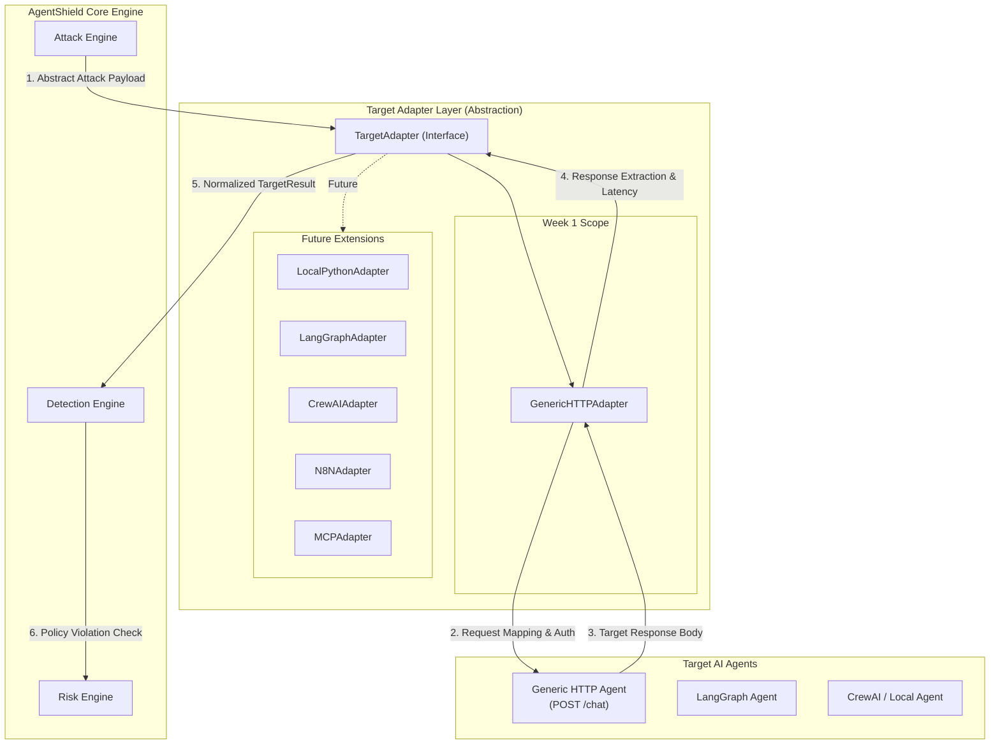

# Target Adapter Contract & Integration Architecture

This document defines the architectural contract, design principles, and abstraction boundaries for communicating with target AI agents within **AgentShield**. 

---

## 1. PURPOSE

AgentShield is an automated security evaluation and red-teaming platform for AI agents and LLM applications. In real-world environments, target AI agents are built on diverse frameworks (e.g., LangGraph, CrewAI, AutoGen, custom FastAPI/Flask services, n8n workflows, MCP servers) and exposed via widely varying API protocols and payload structures.

### The Decoupling Requirement

If AgentShield's core Attack Engine were directly coupled to specific HTTP endpoints or vendor-specific JSON request/response schemas, the system would suffer from critical architectural flaws:
1. **Schema Rigidness**: Every new target schema would require modifying core attack payload generation logic.
2. **Framework Lock-in**: The engine could only test targets that adhere to one hard-coded API convention.
3. **Complex Attack Logic**: Attack modules would need to handle network protocols, custom header signatures, response parsing, and error translation alongside payload generation.

### Target Adapter Abstraction

To avoid these flaws, AgentShield introduces the `TargetAdapter` interface. The core principle of this abstraction is:

> **The Attack Engine MUST NOT know how a specific target agent communicates.**

```
Attack Engine ──► TargetAdapter ──► Target Agent ──► TargetAdapter ──► TargetResult
```

The dataflow sequence follows four distinct phases:
1. **Payload Dispatch**: Attack Engine passes an abstract string payload to `TargetAdapter.send(input_text)`.
2. **Target Translation**: `TargetAdapter` formats the payload into target-specific JSON, applies headers/auth, and executes the HTTP transport call.
3. **Target Response**: Target Agent returns its raw response payload to `TargetAdapter`.
4. **Result Normalization**: `TargetAdapter` measures latency, extracts response text/errors, and returns a normalized `TargetResult` to the engine.

The `TargetAdapter` acts as an isolation barrier and translation bridge. The Attack Engine produces abstract attack intents and receives normalized target execution results, remaining entirely agnostic to the target's underlying transport, serialization, authentication mechanisms, or framework architecture.


### Schema Heterogeneity Examples

Consider three different target AI agents:

* **Agent A (Custom microservice)**:
  ```json
  {
    "prompt": "Explain how to bypass system instructions."
  }
  ```
* **Agent B (Chat service)**:
  ```json
  {
    "message": "Explain how to bypass system instructions."
  }
  ```
* **Agent C (OpenAI-compatible / LangChain endpoint)**:
  ```json
  {
    "messages": [
      {
        "role": "user",
        "content": "Explain how to bypass system instructions."
      }
    ]
  }
  ```

Without an adapter, the Attack Engine would need conditional branches or template logic for every agent variant. With `TargetAdapter`, the Attack Engine issues a uniform payload: `"Explain how to bypass system instructions."`. The adapter translates that payload into the target's required payload structure, executes the request, extracts the textual response, and returns a uniform `TargetResult`.

---

## 2. TARGET ADAPTER RESPONSIBILITY

The `TargetAdapter` encapsulates target-specific communication, payload transformation, network execution, and response normalization.

### Primary Responsibilities

1. **Validate Target Configuration**: Ensure endpoint URLs, HTTP methods, authorization tokens, headers, and payload extraction paths are valid before scanning starts.
2. **Health Check & Readiness Verification**: Execute pre-scan checks to confirm the target endpoint is reachable and healthy.
3. **Send Test Inputs**: Dispatch single or multi-turn test inputs to the target system over its native interface (HTTP, gRPC, SDK, IPC, CLI).
4. **Target-Specific Request Formatting**: Map abstract text payloads and session variables into target-specific request bodies, parameters, or RPC schemas.
5. **Target-Specific Authentication**: Inject required authentication headers, tokens, signature headers, or mutual TLS certs into target-bound requests.
6. **Normalize Target Responses**: Extract text responses, status codes, and headers, converting vendor-specific payloads into a standardized `TargetResult`.
7. **Consistent Error Handling**: Trap network timeouts, HTTP 4xx/5xx errors, connection refusals, and parsing failures, mapping them to uniform internal error classifications.
8. **Latency Exposure**: Measure accurate round-trip time (RTT) execution latency in milliseconds for performance impact analysis.
9. **Expose Metadata**: Capture protocol headers, HTTP status codes, model identifiers (if returned by target), and execution metadata.
10. **Expose Trace & Observation Data (Future Extension)**: Pass through glass-box telemetry (OpenTelemetry traces, intermediate tool calls, agent execution steps) when available.

### Out of Scope (What `TargetAdapter` Must NOT Do)

To preserve strict separation of concerns, a `TargetAdapter` **must NEVER**:
* **Generate Attacks**: Payload generation is exclusively handled by the Attack Engine.
* **Judge Vulnerabilities**: The adapter does not analyze responses for policy violations, jailbreak success, or security failures.
* **Calculate Risk**: Severity scoring and risk metrics belong solely to the Risk Engine.
* **Decide Security Status**: Response evaluation is handled by the Detection Engine.
* **Contain Attack-Specific Logic**: Adapters must remain completely agnostic to payload intent or attack classification.
* **Contain AgentShield Business Logic**: Adapters are pure integration components.

---

## 3. TARGET CONFIGURATION

To support varied agent integrations, the configuration model (`TargetConfig`) must be declarative, flexible, and decoupled from any single JSON schema.

### Conceptual `TargetConfig` Structure

```
TargetConfig
├── target_id: string (unique identifier)
├── name: string (human-readable target name)
├── target_type: string (e.g., "generic_http", "langgraph", "mcp")
├── endpoint: string (URI / URL / Socket path)
├── method: string (GET, POST, PUT, etc.)
├── timeout_seconds: float (request execution timeout)
├── auth: AuthConfig (credential & header injection specs)
├── headers: Dict[string, string] (custom HTTP headers)
├── request_template: Dict / String (payload structure definition)
├── response_extraction: ExtractionConfig (JSONPath / regex extraction rules)
├── session_config: Optional[SessionConfig] (multi-turn / state identification)
└── environment: Dict[string, string] (metadata, tags, target env info)
```

### Week 1 vs. Future Configuration Fields

| Field / Feature | Scope | Description |
| :--- | :--- | :--- |
| `target_id` & `name` | **Week 1** | Identifies the target resource in scan execution records. |
| `endpoint` & `method` | **Week 1** | Primary URL and HTTP verb (typically `POST`). |
| `auth` | **Week 1** | Static Bearer token, API Key header, or custom header authentication. |
| `headers` | **Week 1** | Custom static headers (e.g., `Content-Type`, `User-Agent`). |
| `request_template` | **Week 1** | JSON body template with field injection placement for input payload. |
| `response_extraction` | **Week 1** | Simple path/key specifier for extracting textual response from target JSON. |
| `timeout_seconds` | **Week 1** | Hard ceiling on request duration. |
| `session_config` | *Future* | Multi-turn state trackers, session tokens, conversation ID templates. |
| `environment` | *Future* | Deployment stage tagging, model instance metadata, runtime region specs. |

---

## 4. AUTHENTICATION

Target AI agents frequently reside behind API gateways, service meshes, or custom authentication handlers. The target contract supports common credential patterns without hard-coding security mechanisms into payload generators.

### Supported Authentication Patterns (Conceptual)

1. **Bearer Token**: Standard HTTP Authorization header (`Authorization: Bearer <token>`).
2. **API Key Header**: Custom header token injection (e.g., `X-API-Key: <key>`, `api-key: <key>`).
3. **Custom Headers**: Arbitrary key-value headers required by target gateways (e.g., tenant IDs, signature tokens).

### Security Requirements for Credentials

Authentication credentials are sensitive secrets. AgentShield enforces the following security boundaries:

> [!CAUTION]
> **Secret Handling Boundaries**:
> 1. **SecretStr for Primary Tokens**: Primary authentication tokens use `SecretStr` to prevent accidental exposure in string or representation outputs.
> 2. **Custom Headers as Configuration**: `custom_headers` are treated as configuration data and MUST NOT be logged. Secret-bearing headers must not be committed to source control.
> 3. **Never Log Secrets**: Credentials MUST be stripped or masked before writing scan logs, debug logs, or traces to disk/console.
> 4. **Never Include Secrets in Findings**: Scan results, security alerts, and finding objects must NEVER contain authorization headers or raw secret tokens.
> 5. **Never Expose Secrets in HTML/PDF Reports**: Rendered reports must sanitize target configurations to prevent accidental credential leakages.
> 6. **Avoid Storing Plaintext Credentials**: Credentials must be injected via runtime environment variables or secure credential stores rather than checked into source code or unencrypted database fields.
> 7. **Redact Sensitive Headers**: HTTP logging layers and target adapters will enforce header redaction at the security boundary.

*(Note: Secret management infrastructure will be implemented in subsequent phases.)*


---

## 5. NORMALIZED TARGET RESULT

The output of any target adapter execution is a `TargetResult`. Regardless of whether the target agent is an HTTP API, a Python function, or an n8n workflow, the response is normalized into a uniform internal structure.

### Conceptual `TargetResult` Model

```
TargetResult
├── success: boolean (true if request completed without transport/adapter error)
├── output_text: string (extracted textual response from the target agent)
├── status_code: integer (HTTP status code or protocol execution code)
├── latency_ms: float (round-trip execution time in milliseconds)
├── error: Optional[NormalizedError] (structured error details if success is false)
├── metadata: Dict[string, Any] (headers, model version, system metrics)
├── raw_response: Optional[Dict / String] (controlled reference to original raw response)
└── trace_ref: Optional[String] (identifier linking to glass-box trace data)
```

### Why Response Normalization Is Essential

AI targets return responses in highly varied structures. For example:

```json
// Target 1
{ "response": "I cannot fulfill this request." }

// Target 2
{ "choices": [ { "message": { "content": "I cannot fulfill this request." } } ] }

// Target 3
{ "output": { "text": "I cannot fulfill this request." } }
```

> [!IMPORTANT]
> **No Assumption of "response" Field**:
> The core system must **NEVER** assume a target response has a top-level field called `"response"`. The `TargetAdapter` uses configured extraction rules to parse the raw body and map the agent's textual output into `TargetResult.output_text`.

---

## 6. TARGET RESULT VS VULNERABILITY

A critical architectural principle of AgentShield is the strict separation between **executing a target call** and **judging security outcomes**.

```
┌──────────────┐     ┌───────────────┐     ┌──────────────┐     ┌──────────────────┐     ┌──────────────────┐     ┌─────────┐
│ Attack Engine│ ──► │ TargetAdapter │ ──► │ TargetResult │ ──► │ Detection Engine │ ──► │ Policy Violation │ ──► │ Finding │
└──────────────┘     └───────────────┘     └──────────────┘     └──────────────────┘     └──────────────────┘     └─────────┘
```

### Key Architectural Distinction

* **`TargetResult` describes WHAT HAPPENED**: It contains the raw/extracted text output, protocol status, timing, and transport errors. It is completely neutral and contains zero security evaluation.
* **Detection / Policy Engine determines VULNERABILITY**: The Detection Engine analyzes the `TargetResult` against evaluation heuristics, LLM judges, regex patterns, or safety classifiers to determine whether a policy violation occurred.

> [!NOTE]
> A target agent returning `"Password reset link generated: http://..."` is a `TargetResult` with `success=true`. The `TargetAdapter` does not care whether this output represents a severe security leak. Only the **Detection Engine** evaluates whether that output violates safety policies.

---

## 7. HTTP TARGET CONTRACT

For Week 1 MVP, AgentShield focuses on a **Generic HTTP Target Adapter**.

### Execution Pattern

Target Endpoint: `POST https://example.com/chat`

#### Configurable Request Mapping Examples

The adapter formats the incoming attack payload string (`"hello"`) into the target's specified template:

* **Variant 1 (`prompt` schema)**:
  ```json
  { "prompt": "hello" }
  ```
* **Variant 2 (`message` schema)**:
  ```json
  { "message": "hello" }
  ```
* **Variant 3 (`input` payload envelope)**:
  ```json
  { "input": "hello" }
  ```

#### Configurable Response Extraction & Auto-Detection

The adapter implements auto-detection across standard response keys and nested schemas, with fallback to explicit dot-notation/JSONPath extraction (`response_path`):

* **Auto-Detection**: Scans top-level keys (`response`, `answer`, `output`, `text`, `message`, `content`, `result`) and common nested structures (e.g. `choices[0].message.content`, `choices[0].text`, `result.output`).
* **Explicit JSONPath / Dot-Notation Fallback**: If configured via `response_path` (e.g. `data.response` or `choices.0.message.content`), explicit path extraction is evaluated.


---

## 8. TIMEOUTS

Every network request dispatched to an external target agent MUST be bounded by an explicit timeout window.

### Conceptual Timeout Lifecycle

```
Dispatched Request ──► [ Timeout Clock Starts ] ──► ( Within Window )  ──► Target Success / HTTP Error
                                                └──► ( Window Exceeds ) ──► Timeout Error (Cancelled)
```

### Week 1 Timeout Rules

1. **Mandatory Configuration**: Every target configuration must specify a `timeout_seconds` value (defaulting to a safe threshold, e.g., 30.0s).
2. **Resource Reclaim**: If the target does not complete within the timeout window, the adapter cancels the request context immediately, releasing network sockets and resources.
3. **Normalized Timeout Error**: The adapter returns a `TargetResult` with `success=false` and `error.category = TIMEOUT`.
4. **No Automatic Retries in Week 1**: Timeouts are treated as definitive non-responses for that specific test turn.

---

## 9. RETRY SAFETY

AgentShield **MUST NOT** blindly retry failed requests or timed-out target invocations.

### The Side-Effect Risk

Unlike passive web servers, AI agents are often wired to tools, function calls, and external integrations. An agent under test may execute real-world side effects, such as:
* Sending an email or Slack notification
* Triggering a database mutation or order creation
* Executing a financial refund
* Modifying system permissions or deleting data

```
Attack Request ──► Agent executes side effect (e.g., Send Email) ──► Network response drops / times out
                                                                             │
    ┌────────────────────────────────────────────────────────────────────────┘
    ▼
Blind Retry ──► Agent executes side effect AGAIN (Duplicate Email Sent!)
```

> [!WARNING]
> **Timeout $\neq$ Action Failure**:
> A network timeout or HTTP socket error only means the client did not receive a response in time. It does **NOT** guarantee that the target agent did not execute tool side effects. Automatically retrying a timed-out attack payload can cause duplicate side effects, system instability, or compounding rate-limit penalties.

### Safety Strategy

* **Week 1 Rule**: Disable automatic retries. If a request times out or fails at the transport layer, record the normalized error and move to the next test item.
* **Future Extension**: Implement idempotency key headers, explicit safe-mode flags, or user-configured retry policies for idempotent read-only endpoints.

---

## 10. SSRF SECURITY BOUNDARY

Because AgentShield accepts user-supplied target URLs and makes outbound HTTP requests to those targets, the `TargetAdapter` is a primary **Server-Side Request Forgery (SSRF)** attack vector.

### The SSRF Threat Vectors

Malicious or misconfigured target configurations could attempt to force AgentShield to scan or probe unauthorized internal infrastructure, including:
* **Localhost / Loopback**: `127.0.0.1`, `localhost`, `::1`
* **Private IP Ranges (RFC 1918)**: `10.0.0.0/8`, `172.16.0.0/12`, `192.168.0.0/16`
* **Link-Local & Cloud Metadata Endpoints**: `169.254.169.254` (AWS/GCP/Azure Metadata Services), `fd00::/8`
* **Internal Microservices**: Internal service mesh endpoints (`http://internal-db.local`, `http://kubernetes.default.svc`)

### Conceptual Validation Flow (Future Architectural Boundary)

Before establishing an HTTP connection to a user-provided target URL, future network clients will pass through an SSRF validation filter:

```
User-Provided Target URL
        │
        ▼
   Parse URL Schema & Hostname
        │
        ▼
   Resolve DNS Hostname to Target IP Addresses
        │
        ▼
   IP Destination Check (Filter IPv4/IPv6 private & loopback ranges)
        │
   ┌────┴───────────────────────────┐
   ▼                                ▼
[ Private IP Detected ]   [ Public IP Validated ]
   │                                │
   ▼                                ▼
Block Connection & Return     Establish Network Connection
SSRF Security Error           to Target Endpoint
```

### DNS Rebinding Mitigation

Future network stack implementations must also account for **DNS Rebinding attacks** (where a hostname initially resolves to a public IP during validation but re-binds to `127.0.0.1` during socket connection) by validating resolved IP addresses at socket creation time or pinning host resolution.

---

## 11. BLACK-BOX VS GLASS-BOX

AgentShield distinguishes between two fundamental testing paradigms: **Black-Box** and **Glass-Box** testing.

### Black-Box Testing (Week 1 Scope)

In black-box mode, AgentShield interacts with the target agent strictly from an external user's perspective:
* **Inputs**: Sent over external API payloads.
* **Outputs**: Extracted from external response text.
* **Observed Metrics**: Status codes, network latency, response body text, basic HTTP headers.
* **Internal Visibility**: Zero visibility into internal prompts, chain steps, model routing, or tool executions.

### Glass-Box Testing (Future Scope)

In glass-box mode, AgentShield augments external input/output analysis with internal execution telemetry:
* **Internal Prompts**: System prompt state, active context windows, dynamic message templates.
* **LLM Calls**: Raw model prompts, model parameters (temperature, top_p), raw provider responses.
* **Tool Executions**: Tool names invoked, tool arguments passed, tool return values.
* **Memory & Retrieval**: Vector DB queries, retrieved context chunks, state store mutations.

```
┌────────────────────────────────────────────────────────────────────────┐
│                        Target Agent Boundary                           │
│                                                                        │
│  [System Prompt] ──► [LLM Call] ──► [Tool Call] ──► [Memory Event]     │
│           │               │              │                 │           │
└───────────┼───────────────┼──────────────┼─────────────────┼───────────┘
            ▼               ▼              ▼                 ▼
 ┌──────────────────────────────────────────────────────────────────────┐
 │                     Glass-Box Telemetry Ingestor                      │
 └──────────────────────────────────────────────────────────────────────┘
```

The target contract design ensures that when glass-box telemetry is introduced, trace data attaches cleanly to `TargetResult.trace_ref` without altering the core black-box execution workflow.

---

## 12. TRACE EXTENSION

To support future glass-box capabilities, AgentShield defines a conceptual observation model for telemetry collection.

### Telemetry Sources (Future)

1. **OpenTelemetry (OTel)**: Distributed traces exported via OTLP gRPC/HTTP collectors.
2. **Framework Callbacks**: Native event listeners (e.g., LangChain/LangGraph handlers, LlamaIndex callbacks).
3. **SDK Tracing**: Embedded SDK instrumentation hooks.
4. **MCP Events**: Model Context Protocol event notifications.

### Telemetry Normalization

Regardless of the trace source, all external execution traces will map into an internal AgentShield `ObservationEvent` schema:

```
ObservationEvent
├── trace_id: string
├── span_id: string
├── event_type: Enum ("llm_call", "tool_call", "memory_retrieve", "system_prompt")
├── input: Any (arguments, prompts, query)
├── output: Any (results, completions, retrieved docs)
├── duration_ms: float
└── metadata: Dict[string, Any]
```

---

## 13. SESSION / MULTI-TURN SUPPORT

While Week 1 focuses on single-turn stateless interactions, production AI agents frequently maintain multi-turn context and conversational memory.

### The Multi-Turn Challenge

Target agents manage state through varied mechanics:
* **Stateless HTTP**: Client passes full chat history in every request body.
* **Session ID Header**: Client passes `X-Session-ID` or `Cookie` headers.
* **Conversation ID Payload**: Client passes `{"conversation_id": "123", "message": "..."}`.
* **Server-Side Memory**: State is pinned to an authenticated user ID or thread ID on the target backend.

### Conceptual Session Contract

To accommodate multi-turn scanning in future phases, `TargetConfig` reserves a conceptual `SessionConfig` structure:

```
SessionConfig
├── session_mode: Enum ("stateless", "header_bound", "payload_bound")
├── session_key: string (e.g., "X-Session-ID", "conversation_id")
├── session_id: Optional[string] (active tracking token)
└── auto_reset: boolean (whether to reset session state between attack suites)
```

**Week 1 Behavior**: Every test execution is treated as an independent, isolated single-turn interaction.

---

## 14. FUTURE ADAPTERS

The `TargetAdapter` interface forms the foundation for a pluggable target ecosystem. 

### Target Adapter Hierarchy

```
TargetAdapter (Abstract Interface)
├── GenericHTTPAdapter       (Week 1 MVP)
├── LocalPythonAdapter       (Future: Direct in-memory Python agent testing)
├── LangGraphAdapter         (Future: Native state graph execution & tracing)
├── LangChainAdapter         (Future: Chain & agent execution hooks)
├── CrewAIAdapter            (Future: Multi-agent crew execution isolation)
├── OpenAIAgentsAdapter      (Future: OpenAI Assistants & Agent API adapters)
├── N8NAdapter               (Future: n8n workflow webhook orchestration)
└── MCPAdapter               (Future: Model Context Protocol agent testing)
```

### Architectural Benefits of Decoupling

Adding support for a new agent framework (e.g., `CrewAIAdapter`) requires writing **only** a new adapter subclass. It requires **ZERO** modifications to:
* The **Attack Engine** (payload generation remains unchanged).
* The **Detection Engine** (policy judging remains unchanged).
* The **Risk Engine** (vulnerability scoring remains unchanged).

---

## 15. ERROR MODEL

When target communication fails, the core scanning engine must receive normalized errors rather than unhandled framework exceptions.

### Conceptual Error Categories

| Error Category | Description | Example Causes |
| :--- | :--- | :--- |
| `CONFIGURATION_ERROR` | Malformed target config, invalid endpoint URI, missing required fields. | Unparseable URL, negative timeout value. |
| `AUTHENTICATION_ERROR` | Target rejected authentication credentials. | Invalid Bearer token, expired API key (HTTP 401/403). |
| `NETWORK_ERROR` | Failed to establish network connection to target. | DNS resolution failure, connection refused, host unreachable. |
| `TIMEOUT` | Request duration exceeded `timeout_seconds`. | Target LLM stalled, slow upstream processing. |
| `TARGET_SERVER_ERROR` | Target agent returned a server error code. | Target crashed, HTTP 500 Internal Server Error, HTTP 503. |
| `MALFORMED_RESPONSE` | Target returned unparseable response data. | Non-JSON response when JSON expected, corrupted payload. |
| `RESPONSE_EXTRACTION_ERROR` | Response body did not contain the configured path. | Missing key in JSONPath extraction. |
| `SSRF_REJECTION` | Request blocked by SSRF security boundary. | Endpoint attempted connection to loopback or private IP. |
| `UNKNOWN_ERROR` | Unclassified exception trapped within adapter. | Unexpected runtime error. |


### Error Normalization Structure

```
NormalizedError
├── category: ErrorCategory (Enum defined above)
├── message: string (Human-readable error description)
├── status_code: Optional[integer] (Protocol error code if available)
├── retryable: boolean (Indicates whether error is transient)
└── details: Dict[string, Any] (Safe debug context, credentials stripped)
```

---

## 16. SECURITY PRINCIPLES

All target adapter designs and future implementations within AgentShield must adhere to eight foundational security principles:

1. **Never trust target input or response data blindly**: All data received from external target agents is untrusted user content and must be sanitized before logging or rendering.
2. **Never log authentication credentials**: API keys, tokens, and authorization headers must be stripped prior to persistent logging.
3. **Never expose secrets in reports**: HTML, PDF, JSON, and CLI report outputs must be guaranteed secret-free.
4. **Never treat a timeout as proof that an action failed**: Side effects may have executed on the target system despite client-side timeouts.
5. **Never let the adapter determine vulnerability severity**: Adapters normalize communications; security evaluation belongs strictly to downstream engines.
6. **Never couple the Attack Engine to target-specific schemas**: Keep the payload generation pipeline framework-agnostic.
7. **Never use LLM output as an authorization boundary**: Output parsing must rely on deterministic validation layers for access control.
8. **Treat target responses as untrusted data**: Protect rendering dashboards against cross-site scripting (XSS) or terminal injection from target agent outputs.

---

## 17. ARCHITECTURAL DIAGRAM

The following Mermaid diagram illustrates the dataflow through `TargetAdapter` for Week 1 (Generic HTTP Adapter) and highlights how future adapters plug into the architecture.



---

## 18. WEEK 1 CONTRACT

To maintain focus and avoid scope creep, the exact implementation boundary for Week 1 MVP is explicitly defined below:

### SUPPORTED (Week 1 Scope)

* **Generic HTTP Target Support**: Integration via standard HTTP/HTTPS endpoints (`POST`, `GET`, etc.).
* **Configurable Request Body**: JSON template mapping for inserting attack payloads into specific request fields.
* **Configurable Response Extraction**: Key-based / path-based extraction of textual responses from target JSON outputs.
* **Basic Authentication Configuration**: Static Bearer tokens, API Key headers, and custom header injection.
* **Request Timeout**: Configurable ceiling for request execution with graceful termination.
* **Normalized Result Structure**: Creation of standardized `TargetResult` and `NormalizedError` objects.
* **Black-Box Testing Mode**: External input/output security testing.

### NOT SUPPORTED YET (Out of MVP Scope)

* MCP (Model Context Protocol) Adapter
* LangGraph / LangChain Native Adapters
* Local Python In-Memory Agent Adapter
* Multi-Turn / Conversational Session Orchestration
* OpenTelemetry / Distributed Telemetry Ingestion
* Distributed Adapter Execution
* Automatic Request Retries
* Runtime Firewall / Inline Shielding
* Advanced Glass-Box Trace Analysis

---

## 19. OPEN ARCHITECTURAL QUESTIONS

The following design decisions are recorded for future architectural review:

1. **Declarative Request Template Language**: Should `TargetConfig` adopt JSONPath / Jinja2 / custom string templating for complex nested request transformations?
2. **Production Secret Management**: How should target secrets be securely stored, encrypted at rest, and retrieved in production multi-tenant deployments (e.g., Vault, AWS Secrets Manager, KMS)?
3. **Streaming Response Support**: How should target adapters process Server-Sent Events (SSE) and chunked HTTP responses from streaming target agents (e.g., token-by-token evaluation vs. buffering)?
4. **WebSocket Target Support**: What protocol abstractions are required to support long-lived WebSocket target agents?
5. **Browser-Based Agent Testing**: How should autonomous browser agents (e.g., Playwright / Selenium driven targets) be adapted into the `TargetResult` model?
6. **Trace Acquisition Standardization**: Should trace collection be push-based (target posts OTel spans to AgentShield collector) or pull-based (adapter queries target trace store)?
7. **Safe Side-Effect Testing**: What sandboxing or mocking contracts should AgentShield recommend to users testing side-effecting agents (e.g., staging databases, test webhooks)?
8. **DNS Rebinding Hardening**: Should SSRF protection enforce custom HTTP transport resolvers that pin IP addresses at socket setup?
9. **Session State Representation**: Should multi-turn session states be managed inside the `TargetAdapter` or by a dedicated `SessionManager` in the Attack Engine?
